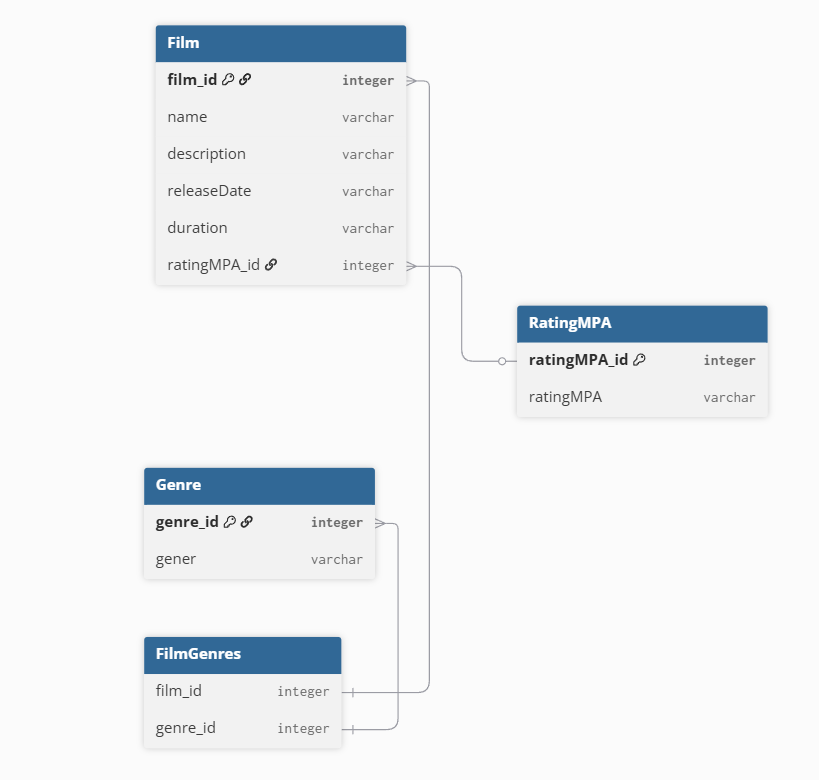
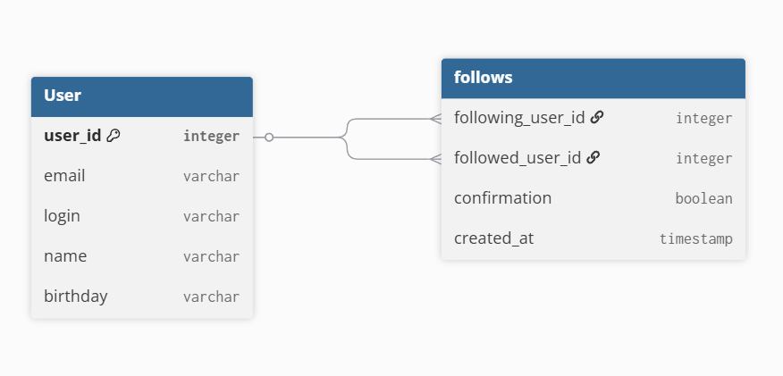

# java-filmorate

## Схема БД для хранения фильмов 

### Описание схемы 

```
Table Genre {
genre_id integer [primary key]
gener varchar
}

Table RatingMPA {
ratingMPA_id integer [primary key]
ratingMPA varchar
}

Table Film {
film_id integer [primary key]
name varchar
description varchar
releaseDate varchar
duration varchar
ratingMPA_id integer
}

Table FilmGenres {
film_id integer
genre_id integer
}
```
В таблице Genre будут храниться ограниченное списком (enum) значения -
```
public enum Genre{
Comedy,
Drama,
Animation,
Thriller,
Documentary,
Action
}
```
В таблице RatingMPA будут храниться ограниченное списком (enum) значения -
```
public enum RatingMPA{
G,
PG,
PG-13,
R,
NC-17
}
```
Таблица FilmGenres необходима для хранения соответствия конкретного фильма с жанрами, поскольку фильм может относиться сразу к нескольким жанрам

## Схема БД для хранения пользователей

### Описание схемы 
Table User {
```
user_id integer [primary key]
email varchar
login varchar
name varchar
birthday varchar
}

Table follows {
following_user_id integer
followed_user_id integer
confirmation varchar
created_at timestamp
}
```
В таблице follows харнится информация о запросе добавления в друзья. Если пользователь подтвердил заявку, поле confirmation принимает значение true. По умолчанию данное поле принимает значение false