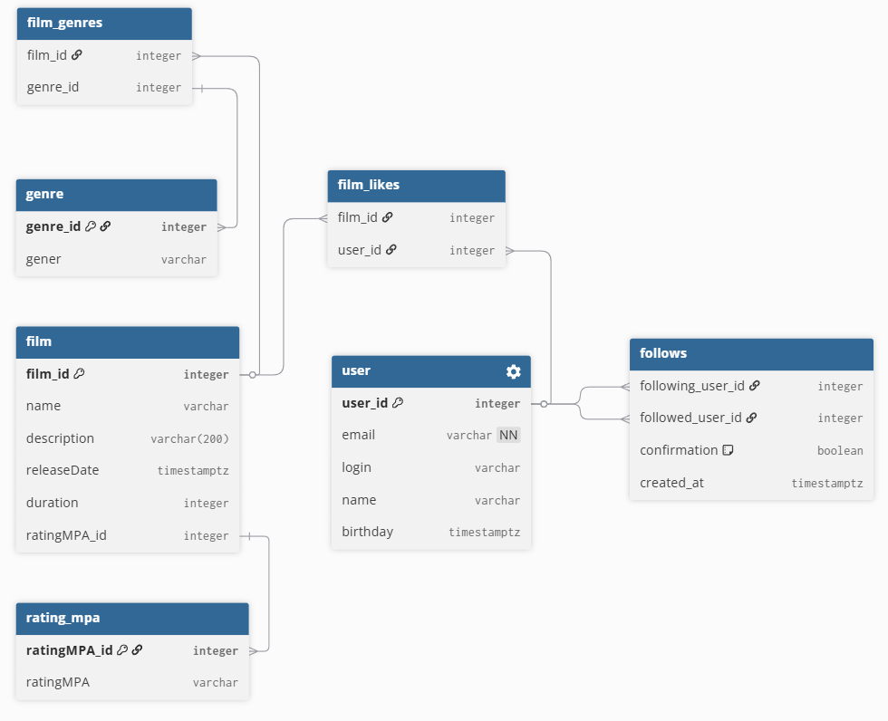

# java-filmorate

## Общая схема БД

### Описание схемы 

```
Table genre {
  genre_id integer [primary key]
  gener varchar
}

Table rating_mpa {
  ratingMPA_id integer [primary key]
  ratingMPA varchar
}

Table film {
  film_id integer [primary key]
  name varchar
  description varchar(200)
  releaseDate timestamptz 
	duration integer
	ratingMPA_id integer
}

Table film_genres {
  film_id integer
  genre_id integer
}

Table film_likes {
  film_id integer
  user_id integer
}

Table user {
  user_id integer [primary key]
  email varchar [not null]
	login varchar
  name varchar
  birthday timestamptz
}

Table follows {
  following_user_id integer
  followed_user_id integer
  confirmation boolean [default: false]
  created_at timestamptz
}
```

Таблица __film_genres__ необходима для хранения соответствия конкретного фильма с жанрами, поскольку фильм может относиться сразу к нескольким жанрам

Таблица __genre__ хранит список жанров 

Таблица __rating_mpa__ хранит список рейтингов

В таблице __follows__ харнится информация о запросе добавления в друзья. Если пользователь подтвердил заявку, поле confirmation принимает значение true. По умолчанию данное поле принимает значение false

В таблице __film_likes__ собрана информация по проставленным лайкам